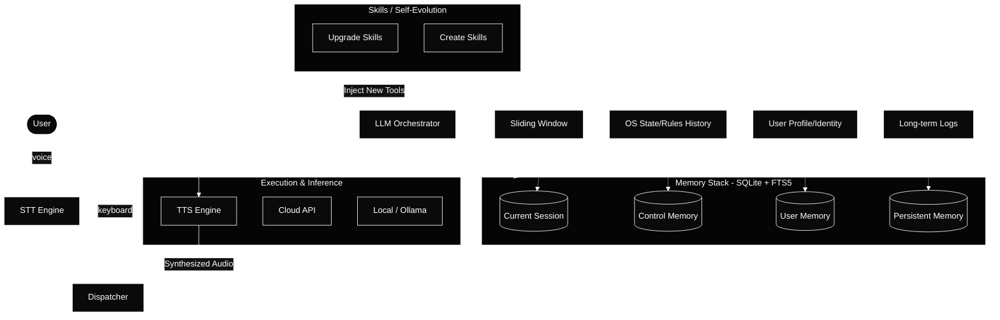

# ARCHITECTURE.md

> This document is for contributors and maintainers. If you're new to MOAI, read the README first.

---

## 1. Architecture Diagram

This is the full picture of how MOAI works. Every arrow is a real communication path.

---

## 2. Component Breakdown

### 🎙️ STT Engine

The STT (Speech-to-Text) engine is the entry point for voice input. When you speak, it captures the raw audio, detects when you started and stopped talking using Silero VAD (Voice Activity Detection), and transcribes your words to text. The result gets passed straight to the Dispatcher.

At onboarding, you pick which STT backend to use — either a local engine that runs fully on your machine (e.g. faster-whisper) or a cloud-based one for users who prefer offloading transcription (e.g. WhisperFlow).

Typing bypasses the STT engine entirely — keyboard input goes directly to the Dispatcher.

---

### ⚡ Dispatcher

The Dispatcher is the central coordinator of MOAI. Every input — whether it came from voice or keyboard — passes through it. It decides what needs to happen, routes the job to the right component, and assembles the final response. Nothing in MOAI talks to anything else without going through the Dispatcher first.

It is built in Rust, which means it is fast, lightweight, and always on. It also handles the TUI — what you see on screen is driven by the Dispatcher updating the display as things happen.

---

### 🧠 LLM Orchestrator

The LLM Orchestrator is the brain of MOAI. It receives the user's message from the Dispatcher, pulls relevant context from memory, builds a prompt, and sends it to the right model via the LLM router. It also decides whether a skill needs to be invoked — if the user asks MOAI to do something on the machine, the orchestrator triggers the right skill agent.

**LLM Router**
Sits inside the orchestrator. When a model call is needed, it checks what the user configured at onboarding — local Ollama model (like `qwen3:30b-a3b`) or a cloud provider (OpenAI, Anthropic, etc.) — and routes accordingly. If both are configured, it can fall back to cloud when local is unavailable.

---

### 🔊 Execution & Inference

Three things live here:

**Local / Ollama**
The local model backend. Runs entirely on your machine, zero network required. MOAI's default and preferred path.

**Cloud API**
Optional cloud fallback. OpenAI, Anthropic, or any compatible provider. Opt-in only — never required for core features.

**TTS Engine**
Converts the LLM's text response to speech. Processes sentence by sentence so audio starts playing before the full response is generated — no waiting. Like STT, you pick the backend at onboarding — local (e.g. Kokoro-82M) or cloud-based. The synthesized audio routes back to the Dispatcher for playback.

---

### 🗄️ Memory Stack — SQLite + FTS5

MOAI uses SQLite with FTS5 (Full-Text Search) as its memory database. SQLite is a single file on your disk — no server, no setup, no network. FTS5 lets MOAI search memory by keywords and meaning, not just exact matches.

Memory has four layers:

**Current Session** *(Sliding Window)*
Everything said in the current conversation. Acts as a sliding window — the most recent context is always in view. Cleared when the session ends.

**Control Memory** *(OS State / Rules History)*
What makes MOAI different from every other AI assistant. Every action MOAI takes on your machine — running a command, opening a file, sending a message — gets written here along with what happened. MOAI learns from its own actions over time, not just conversations.

**User Memory** *(User Profile / Identity)*
Who you are. Your name, preferences, working style, projects you care about. MOAI builds this up passively as it learns more about you across sessions.

**Persistent Memory** *(Long-term Logs)*
Long-term factual memory that survives across sessions. Things MOAI has been explicitly told or has concluded are important enough to keep permanently.

---

### 🛠️ Skills / Self-Evolution

Skills are what MOAI uses to act on the world — web search, file operations, system control, sending messages, and anything else that goes beyond just talking.

What makes this pillar different is the self-evolution loop. MOAI can not only run existing skills — it can upgrade them and create new ones based on what it learns. New skills get injected back into the LLM Orchestrator, expanding what MOAI can do without a manual update.

Each skill is a single Python file in `skills/`. Adding a new capability means adding a new file. Nothing else changes.

---

## 3. Key Design Decisions & Tradeoffs

**Rust core + Python agents, not all-in-one**

We could have written MOAI entirely in Python. It would have been faster to build. But Python has a real cost: it's slow to start, heavy on memory, and not great for a TUI that needs to feel snappy. Rust gives us a binary that starts in milliseconds and uses almost no RAM for the core loop. Python is kept where it belongs — doing AI work, where its ecosystem (faster-whisper, Kokoro, Ollama clients) is unmatched.

The tradeoff: gRPC adds complexity. There's a schema to maintain and a bridge to keep running. Worth it for the clean separation.

**gRPC over REST or raw sockets**

REST would have been simpler to set up. Raw sockets would have been faster. gRPC is the right middle ground: fast, structured, and self-documenting via Protobuf schemas. If an agent changes its output format, the schema catches the mismatch immediately instead of silently breaking things.

**SQLite over Postgres or a vector database**

Postgres requires a running server. Vector databases (Pinecone, Weaviate, etc.) require cloud accounts or complex local setup. SQLite is a single file. FTS5 gives us good-enough semantic search for a personal assistant. MOAI is built to run on one machine with zero infrastructure — SQLite fits that perfectly.

**Control-aware memory**

Most AI assistants only remember conversations. MOAI remembers *actions* — what it did on your machine and what happened. This is a deliberate architectural choice, not a feature. It required a dedicated memory layer (Control Memory) and a discipline that every skill agent must write its actions to memory before returning a result.

**Single binary distribution**

The Rust core compiles to one binary. A user installs MOAI by running one file. The Python side is handled via a bundled virtual environment. The goal: `curl | sh` install experience, nothing else required.

---

## 4. Out of Scope

These are things outside MOAI's current scope — not permanent decisions.

- **No mobile app.** MOAI is a desktop and server tool. No iOS, no Android.
- **No GUI installer.** Setup is terminal-only. The TUI is themeable for anyone who wants to customize the look.
- **No wake word.** MOAI doesn't listen passively. You press a button to activate it.
- **No browser UI.** Possible in the future, not a current priority.
- **OS support is currently Linux (Arch) only.** Cross-platform support for Windows and macOS is in scope — MOAI is built to get there, just not yet verified outside Linux.
